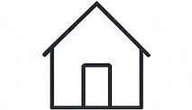

# STRATEGIA MOBILE REDESIGN – TOP-INSTAL
## Wycena 2025 Heat Pump Calculator & Configurator

**Data**: 16 grudnia 2025  
**Autor**: Zordon Design System  
**Wersja**: 1.0

---

## 1. EXECUTIVE SUMMARY

### Cel
Stworzenie profesjonalnego, światowej klasy interfejsu mobilnego dla kalkulatora i konfiguratora pomp ciepła, który:
- Dorównuje designem liderom branży (Viessmann, Mitsubishi, Daikin)
- Zachowuje minimalistyczną elegancję stylu Hetzner
- Maksymalizuje konwersję i user experience na urządzeniach mobilnych

### Kluczowe zasady
1. **Mobile-First Architecture** – priorytowe traktowanie widoku mobilnego
2. **Progressive Disclosure** – ujawnianie informacji krok po kroku
3. **Touch-Optimized** – elementy min. 44×44px, comfortable tap targets
4. **Optical Balance** – przestrzeń oddechowa, optyczne wyśrodkowanie
5. **Microinteractions** – subtelne, eleganckie animacje (0.15-0.25s)

---

## 2. ANALIZA OBECNEGO STANU

### Mocne strony
✅ Solid design system z CSS Variables  
✅ Progress tracking (WorkflowController)  
✅ Error handling i validation  
✅ Onboarding system  
✅ Clean code structure

### Problemy mobile
❌ Desktop-first layout (1300px sections, 64px padding)  
❌ Karty typu budynku za małe na mobile (touch targets)  
❌ Progress bar sticky behavior może być lepszy  
❌ Brak dedykowanych mobile patterns (bottom sheets, swipe gestures)  
❌ Hero section zbyt rozbudowany na mobile  
❌ Form fields mogą być bardziej touch-friendly

---

## 3. BENCHMARKING – LIDERZY BRANŻY

### Viessmann
- **Styl**: Premium, technical, German precision
- **Mobile**: ViGuide app – step-by-step commissioning, clear CTAs
- **Kolory**: Red accent, neutral grays, white space
- **Typography**: Sans-serif, hierarchy 14-28px

### Mitsubishi Electric
- **Styl**: Technical excellence, data-driven
- **Mobile**: Sales Builder Pro – ACCA calculations on-the-go, instant proposals
- **Focus**: Professional tools dla instalatorów
- **UX**: Tablet-optimized (ale działa na phone)

### Daikin
- **Styl**: Innovation + technology
- **Mobile**: 3D AR app – wizualizacja produktów w przestrzeni
- **Interakcje**: AR placement, customization, tech sheets

### Wnioski
- **Minimalism wins**: Czysty, oddychający design
- **Data visibility**: Kluczowe wartości zawsze widoczne (sticky summary)
- **Trust signals**: Certyfikaty, klasy energetyczne, technical specs
- **Touch-first**: Duże przyciski, comfortable spacing
- **Professional tone**: Nie "apka konsumencka", ale narzędzie profesjonalisty

---

## 4. MOBILE DESIGN SYSTEM

### 4.1 Layout Grid
```
Mobile (320-767px):
- Container: 100vw
- Padding: 16px (sides)
- Gap: 16px (vertical), 12px (horizontal)
- Max-width: none (full bleed where appropriate)

Tablet (768-1023px):
- Container: 90vw, max 720px
- Padding: 24px
- Gap: 24px (vertical), 16px (horizontal)
```

### 4.2 Typography Scale (Mobile)
```css
--font-size-xs: 12px;      /* Labels, captions */
--font-size-sm: 14px;      /* Body, secondary */
--font-size-base: 16px;    /* Body primary */
--font-size-md: 18px;      /* Subheadings */
--font-size-lg: 20px;      /* Card titles */
--font-size-xl: 24px;      /* Section headings */
--font-size-2xl: 28px;     /* Page title */
--font-size-3xl: 32px;     /* Hero (mobile) */
```

### 4.3 Spacing System (Mobile)
```css
--spacing-xs: 8px;
--spacing-sm: 12px;
--spacing-md: 16px;
--spacing-lg: 24px;
--spacing-xl: 32px;
--spacing-2xl: 48px;
```

### 4.4 Touch Targets
```
Minimum: 44×44px (WCAG AAA)
Optimal: 48×48px
Large CTAs: 56×56px or full-width
Spacing between: min 8px
```

### 4.5 Color Palette (unchanged from desktop)
```css
--color-accent: #DC143C;           /* Crimson Red */
--color-accent-ti: #168A5D;        /* TI Green (subtle) */
--color-deep-navy: #1A202C;        /* Headers */
--color-text-primary: #1A202C;     /* Body */
--color-text-secondary: #374151;   /* Supporting */
--color-bg-white: #faf9f9;         /* Background */
--color-border: #E0E0E0;           /* Dividers */
```

### 4.6 Border Radius
```css
--radius-sm: 1px;     /* Subtle elements */
--radius-md: 2px;     /* Cards, inputs, buttons */
--radius-lg: 4px;     /* Large cards, modals */
```

### 4.7 Shadows (Mobile – subtle)
```css
--shadow-sm: 0 1px 2px rgba(0,0,0,0.06);
--shadow-md: 0 2px 4px rgba(0,0,0,0.08);
--shadow-lg: 0 4px 8px rgba(0,0,0,0.10);
--shadow-sticky: 0 4px 12px rgba(0,0,0,0.12);
```

---

## 5. MOBILE COMPONENTS REDESIGN

### 5.1 Hero Section (Mobile)
**Obecny problem**: Za długi tekst, za duży obraz  
**Rozwiązanie**:
```html
<section class="hero-mobile">
  <div class="hero-compact">
    <span class="hero-badge">TOP-INSTAL</span>
    <h1>Kalkulator mocy<br>pompy ciepła</h1>
    <p class="hero-lead-short">
      Precyzyjny dobór mocy w 5 minut. 
      Profesjonalna analiza bez rejestracji.
    </p>
  </div>
</section>
```

**Styl**:
- Wysokość: max 50vh (nie blokuje treści)
- Gradient overlay: ciemniejszy dla lepszego kontrastu tekstu
- Typography: 28px title (nie 56px), 14px lead
- Badge: 12px uppercase, subtle shadow
- CTA: hidden w hero (pokazuje się w sticky bar na scroll)

---

### 5.2 Progress Bar (Mobile Enhanced)
**Obecny**: Sticky bar z % i labelem  
**Ulepszenie**:

```html
<div class="progress-mobile">
  <div class="progress-track">
    <div class="progress-fill" style="width: 42%"></div>
  </div>
  <div class="progress-info">
    <span class="progress-step">Krok 3 / 7</span>
    <span class="progress-label">Konstrukcja</span>
  </div>
</div>
```

**Behavior**:
- **Non-sticky by default** – lekka, nie zasłania content
- **Sticky on scroll down** – przykleją się do top z animacją slide-down
- **Hide on scroll up** – znika na scroll w górę (więcej przestrzeni)
- **Thin bar**: 3px height (nie 4px), minimalistyczny
- **Micro-progress**: animacja przy zmianie kroku (ease-out 0.3s)

**CSS**:
```css
.progress-mobile {
  position: relative;
  padding: 12px 16px 8px;
  background: #fff;
  border-bottom: 1px solid #E0E0E0;
  transition: transform 0.25s cubic-bezier(0.4, 0, 0.2, 1);
}

.progress-mobile.sticky {
  position: fixed;
  top: 0;
  left: 0;
  right: 0;
  z-index: 100;
  box-shadow: 0 2px 8px rgba(0,0,0,0.08);
}

.progress-mobile.hidden {
  transform: translateY(-100%);
}

.progress-track {
  height: 3px;
  background: #E0E0E0;
  border-radius: 2px;
  overflow: hidden;
  margin-bottom: 8px;
}

.progress-fill {
  height: 100%;
  background: linear-gradient(90deg, #DC143C 0%, #B91C1C 100%);
  transition: width 0.4s cubic-bezier(0.4, 0, 0.2, 1);
}

.progress-info {
  display: flex;
  justify-content: space-between;
  align-items: center;
  font-size: 13px;
}

.progress-step {
  font-weight: 600;
  color: #374151;
  font-feature-settings: 'tnum';
}

.progress-label {
  color: #6B7280;
  text-align: right;
  max-width: 60%;
  overflow: hidden;
  text-overflow: ellipsis;
  white-space: nowrap;
}
```

---

### 5.3 Building Type Cards (Mobile Optimized)
**Obecny problem**: 4 karty obok siebie – za małe na mobile  
**Rozwiązanie**: 2×2 grid z większymi tap targets

```html
<div class="building-type-grid-mobile">
  <button class="building-card" data-value="single_house">
    <div class="building-card__icon">
      
    </div>
    <span class="building-card__label">Dom wolnostojący</span>
  </button>
  <!-- 3 more cards -->
</div>
```

**Styl**:
```css
.building-type-grid-mobile {
  display: grid;
  grid-template-columns: 1fr 1fr;
  gap: 12px;
  margin: 16px 0;
}

.building-card {
  aspect-ratio: 1;
  display: flex;
  flex-direction: column;
  align-items: center;
  justify-content: center;
  gap: 12px;
  background: #fff;
  border: 2px solid #E0E0E0;
  border-radius: 2px;
  padding: 16px;
  transition: all 0.15s cubic-bezier(0.4, 0, 0.2, 1);
  cursor: pointer;
  -webkit-tap-highlight-color: transparent;
}

.building-card:active {
  transform: scale(0.98);
  background: #FAFAFA;
}

.building-card.selected {
  border-color: #168A5D;
  background: #F0FDF4;
  box-shadow: 0 0 0 3px rgba(22, 138, 93, 0.1);
}

.building-card.selected::after {
  content: '✓';
  position: absolute;
  top: 8px;
  right: 8px;
  width: 20px;
  height: 20px;
  background: #168A5D;
  color: #fff;
  border-radius: 50%;
  font-size: 12px;
  font-weight: 700;
  display: grid;
  place-items: center;
}

.building-card__icon img {
  width: 56px;
  height: 56px;
  object-fit: contain;
}

.building-card__label {
  font-size: 14px;
  font-weight: 600;
  color: #1A202C;
  text-align: center;
  line-height: 1.3;
}
```

**Touch optimization**:
- Min height: 120px (większy tap target)
- Visual feedback: scale 0.98 on tap
- Checkmark: wyraźny selected state
- Spacing: 12px gap (łatwe trafienie)

---

### 5.4 Form Inputs (Mobile Touch-Friendly)
**Obecny**: Desktop-sized inputs  
**Ulepszenie**:

```css
/* Mobile input base */
.form-input-mobile {
  width: 100%;
  height: 52px;
  padding: 0 16px;
  font-size: 16px; /* Important: prevents iOS zoom */
  border: 1px solid #E0E0E0;
  border-radius: 2px;
  background: #fff;
  transition: border-color 0.15s ease;
  -webkit-appearance: none;
  appearance: none;
}

.form-input-mobile:focus {
  outline: none;
  border-color: #DC143C;
  box-shadow: 0 0 0 3px rgba(220, 20, 60, 0.1);
}

/* Select dropdowns */
.form-select-mobile {
  height: 52px;
  padding-right: 40px;
  background-image: url('data:image/svg+xml,...'); /* Custom arrow */
  background-position: right 12px center;
  background-repeat: no-repeat;
  background-size: 16px;
}

/* Number inputs with steppers */
.form-number-mobile {
  display: flex;
  align-items: center;
  gap: 12px;
}

.form-number-mobile input {
  flex: 1;
  text-align: center;
  font-size: 18px;
  font-weight: 600;
}

.form-number-mobile button {
  width: 44px;
  height: 44px;
  border-radius: 2px;
  background: #F3F4F6;
  border: 1px solid #E0E0E0;
  font-size: 20px;
  color: #374151;
  display: grid;
  place-items: center;
}

.form-number-mobile button:active {
  background: #E5E7EB;
}
```

**Kluczowe**:
- **Font-size: 16px** – zapobiega auto-zoom na iOS
- **Height: 52px** – comfortable thumb reach
- **Padding: 16px** – lepsze wizualne wyważenie
- **Custom select arrow** – consistent cross-browser

---

### 5.5 Radio Buttons / Checkboxes (Mobile)
**Obecny**: Standard browser controls  
**Ulepszenie**: Custom, większe, touch-friendly

```html
<label class="radio-mobile">
  <input type="radio" name="zone" value="III">
  <span class="radio-custom"></span>
  <span class="radio-label">Strefa III (-20°C)</span>
</label>
```

```css
.radio-mobile {
  display: flex;
  align-items: center;
  gap: 12px;
  padding: 14px;
  background: #fff;
  border: 1px solid #E0E0E0;
  border-radius: 2px;
  cursor: pointer;
  transition: all 0.15s ease;
  -webkit-tap-highlight-color: transparent;
}

.radio-mobile:active {
  background: #FAFAFA;
}

.radio-mobile input {
  position: absolute;
  opacity: 0;
  pointer-events: none;
}

.radio-custom {
  width: 24px;
  height: 24px;
  border: 2px solid #D1D5DB;
  border-radius: 50%;
  position: relative;
  flex-shrink: 0;
  transition: all 0.15s ease;
}

.radio-mobile input:checked ~ .radio-custom {
  border-color: #168A5D;
  background: #168A5D;
}

.radio-mobile input:checked ~ .radio-custom::after {
  content: '';
  position: absolute;
  top: 50%;
  left: 50%;
  transform: translate(-50%, -50%);
  width: 10px;
  height: 10px;
  background: #fff;
  border-radius: 50%;
}

.radio-label {
  font-size: 15px;
  font-weight: 500;
  color: #1A202C;
}
```

**Advantages**:
- **24px target** – easy to tap
- **Full row clickable** – nie tylko ikona
- **Visual feedback** – active state on tap
- **Accessible** – native input hidden but functional

---

### 5.6 Bottom Sheet Navigation (Mobile Pattern)
**Nowość**: Zamiast fixed buttons, bottom sheet z akcjami

```html
<div class="bottom-nav-mobile">
  <button class="btn-back" disabled>
    <svg>...</svg>
    Wstecz
  </button>
  <button class="btn-next">
    Dalej
    <svg>...</svg>
  </button>
</div>
```

```css
.bottom-nav-mobile {
  position: fixed;
  bottom: 0;
  left: 0;
  right: 0;
  display: flex;
  gap: 12px;
  padding: 16px;
  background: #fff;
  border-top: 1px solid #E0E0E0;
  box-shadow: 0 -2px 8px rgba(0,0,0,0.06);
  z-index: 90;
  transform: translateY(0);
  transition: transform 0.25s cubic-bezier(0.4, 0, 0.2, 1);
}

.bottom-nav-mobile.hidden {
  transform: translateY(100%);
}

.btn-back,
.btn-next {
  flex: 1;
  height: 52px;
  border-radius: 2px;
  font-size: 16px;
  font-weight: 600;
  display: flex;
  align-items: center;
  justify-content: center;
  gap: 8px;
  transition: all 0.15s ease;
}

.btn-back {
  background: transparent;
  border: 1px solid #E0E0E0;
  color: #374151;
}

.btn-back:disabled {
  opacity: 0.4;
  cursor: not-allowed;
}

.btn-next {
  background: linear-gradient(135deg, #DC143C, #B91C1C);
  border: none;
  color: #fff;
  box-shadow: 0 2px 4px rgba(220, 20, 60, 0.2);
}

.btn-next:active:not(:disabled) {
  transform: scale(0.98);
}
```

**Behavior**:
- **Fixed at bottom** – zawsze dostępny, ale nie sticky scroll
- **Hide on keyboard open** – ustępuje miejsca klawiaturze
- **Haptic feedback** – wibracja przy tap (jeśli wspierane)

---

### 5.7 Configurator Selection Bar (Mobile Redesign)
**Obecny**: 4-column grid z małymi labelami  
**Problem**: Overflow, trudno czytać na małym ekranie  
**Rozwiązanie**: Horizontal scroll chips

```html
<div class="config-selections-mobile">
  <div class="selection-chips">
    <div class="chip">
      <span class="chip-label">Pompa</span>
      <span class="chip-value">KIT-WC09K3E5</span>
    </div>
    <div class="chip">
      <span class="chip-label">CWU</span>
      <span class="chip-value">185L Emalia</span>
    </div>
    <!-- more chips -->
  </div>
</div>
```

```css
.config-selections-mobile {
  padding: 12px 0;
  background: #fff;
  border-bottom: 1px solid #E0E0E0;
  position: sticky;
  top: 0;
  z-index: 95;
}

.selection-chips {
  display: flex;
  gap: 8px;
  overflow-x: auto;
  padding: 0 16px;
  scroll-snap-type: x proximity;
  -webkit-overflow-scrolling: touch;
  scrollbar-width: none; /* Firefox */
}

.selection-chips::-webkit-scrollbar {
  display: none; /* Chrome, Safari */
}

.chip {
  flex: 0 0 auto;
  display: flex;
  flex-direction: column;
  gap: 4px;
  padding: 8px 12px;
  background: #F9FAFB;
  border: 1px solid #E5E7EB;
  border-radius: 2px;
  scroll-snap-align: start;
  min-width: 120px;
}

.chip-label {
  font-size: 11px;
  font-weight: 600;
  text-transform: uppercase;
  letter-spacing: 0.5px;
  color: #6B7280;
}

.chip-value {
  font-size: 13px;
  font-weight: 600;
  color: #1A202C;
  white-space: nowrap;
  overflow: hidden;
  text-overflow: ellipsis;
}

.chip.selected {
  background: #F0FDF4;
  border-color: #168A5D;
}

.chip.empty .chip-value {
  color: #9CA3AF;
}
```

**Advantages**:
- **Horizontal scroll** – więcej miejsca, natural mobile gesture
- **Snap points** – smooth scrolling experience
- **Compact** – 120px width per chip, scrollable
- **Clear hierarchy** – label + value stack vertically

---

### 5.8 Product Cards (Configurator Mobile)
**Obecny**: Multi-column grid  
**Ulepszenie**: Single column, swipeable

```html
<div class="product-cards-mobile">
  <div class="product-card" data-product-id="...">
    <div class="product-image">
      
      <span class="product-badge">Rekomendowane</span>
    </div>
    <div class="product-content">
      <h3 class="product-title">KIT-WC09K3E5</h3>
      <p class="product-desc">Pompa ciepła 9kW, 1-fazowa</p>
      <div class="product-specs">
        <span class="spec">
          <svg>...</svg>
          A+++ (35°C)
        </span>
        <span class="spec">
          <svg>...</svg>
          55 dB
        </span>
      </div>
    </div>
    <button class="product-select">
      Wybierz
      <svg>→</svg>
    </button>
  </div>
</div>
```

```css
.product-cards-mobile {
  display: flex;
  flex-direction: column;
  gap: 16px;
  padding: 16px;
}

.product-card {
  background: #fff;
  border: 2px solid #E0E0E0;
  border-radius: 2px;
  overflow: hidden;
  transition: all 0.15s ease;
}

.product-card.selected {
  border-color: #168A5D;
  box-shadow: 0 0 0 3px rgba(22, 138, 93, 0.1);
}

.product-image {
  position: relative;
  height: 180px;
  background: #F9FAFB;
  display: grid;
  place-items: center;
  padding: 16px;
}

.product-image img {
  max-width: 100%;
  max-height: 100%;
  object-fit: contain;
}

.product-badge {
  position: absolute;
  top: 12px;
  right: 12px;
  padding: 4px 10px;
  background: linear-gradient(135deg, #DC143C, #B91C1C);
  color: #fff;
  font-size: 11px;
  font-weight: 700;
  text-transform: uppercase;
  letter-spacing: 0.5px;
  border-radius: 2px;
}

.product-content {
  padding: 16px;
}

.product-title {
  font-size: 18px;
  font-weight: 700;
  color: #1A202C;
  margin: 0 0 4px;
}

.product-desc {
  font-size: 14px;
  color: #6B7280;
  margin: 0 0 12px;
}

.product-specs {
  display: flex;
  gap: 16px;
}

.spec {
  display: flex;
  align-items: center;
  gap: 6px;
  font-size: 13px;
  font-weight: 600;
  color: #374151;
}

.spec svg {
  width: 16px;
  height: 16px;
  color: #168A5D;
}

.product-select {
  width: calc(100% - 32px);
  margin: 0 16px 16px;
  height: 48px;
  background: transparent;
  border: 2px solid #E0E0E0;
  border-radius: 2px;
  font-size: 16px;
  font-weight: 600;
  color: #374151;
  display: flex;
  align-items: center;
  justify-content: center;
  gap: 8px;
  transition: all 0.15s ease;
}

.product-card.selected .product-select {
  background: #168A5D;
  border-color: #168A5D;
  color: #fff;
}

.product-card.selected .product-select svg {
  transform: rotate(-90deg);
}
```

**Swipe gesture** (optional enhancement):
```javascript
// Swipe left = select next product
// Swipe right = select previous product
// Tap = expand details
```

---

## 6. MOBILE NAVIGATION PATTERNS

### 6.1 Tab Navigation (For Results View)
**Use case**: Przełączanie między "Profil energetyczny" i "Konfigurator maszynowni"

```html
<div class="tabs-mobile">
  <button class="tab active" data-view="energy">
    <svg>...</svg>
    Profil energetyczny
  </button>
  <button class="tab" data-view="config">
    <svg>...</svg>
    Konfigurator
  </button>
</div>
```

```css
.tabs-mobile {
  display: flex;
  background: #fff;
  border-bottom: 1px solid #E0E0E0;
  position: sticky;
  top: 0;
  z-index: 90;
}

.tab {
  flex: 1;
  display: flex;
  flex-direction: column;
  align-items: center;
  gap: 4px;
  padding: 12px 8px;
  border-bottom: 3px solid transparent;
  font-size: 13px;
  font-weight: 600;
  color: #6B7280;
  transition: all 0.15s ease;
}

.tab svg {
  width: 20px;
  height: 20px;
}

.tab.active {
  color: #DC143C;
  border-bottom-color: #DC143C;
}

.tab.active svg {
  color: #DC143C;
}
```

---

### 6.2 Accordion Help Boxes (Mobile)
**Problem**: Desktop "help-box" zajmuje za dużo miejsca  
**Rozwiązanie**: Collapsible accordion

```html
<div class="help-accordion-mobile">
  <button class="help-toggle">
    <svg class="icon-info">ℹ️</svg>
    Jak to działa?
    <svg class="icon-chevron">⌄</svg>
  </button>
  <div class="help-content">
    <p>W kilka minut poznasz zapotrzebowanie budynku...</p>
  </div>
</div>
```

```css
.help-accordion-mobile {
  background: #F9FAFB;
  border: 1px solid #E5E7EB;
  border-radius: 2px;
  overflow: hidden;
  margin: 16px 0;
}

.help-toggle {
  width: 100%;
  display: flex;
  align-items: center;
  gap: 8px;
  padding: 12px 16px;
  background: transparent;
  border: none;
  font-size: 14px;
  font-weight: 600;
  color: #374151;
  text-align: left;
  cursor: pointer;
}

.icon-info {
  font-size: 18px;
}

.icon-chevron {
  margin-left: auto;
  font-size: 16px;
  transition: transform 0.2s ease;
}

.help-accordion-mobile.open .icon-chevron {
  transform: rotate(180deg);
}

.help-content {
  max-height: 0;
  overflow: hidden;
  transition: max-height 0.3s cubic-bezier(0.4, 0, 0.2, 1);
}

.help-accordion-mobile.open .help-content {
  max-height: 500px;
  padding: 0 16px 16px;
}

.help-content p {
  font-size: 14px;
  line-height: 1.6;
  color: #6B7280;
  margin: 0;
}
```

---

## 7. MOBILE ANIMATIONS & MICROINTERACTIONS

### 7.1 Page Transitions
```css
/* Step fade-in */
.section-mobile.active {
  animation: sectionFadeIn 0.25s cubic-bezier(0.4, 0, 0.2, 1);
}

@keyframes sectionFadeIn {
  from {
    opacity: 0;
    transform: translateY(8px);
  }
  to {
    opacity: 1;
    transform: translateY(0);
  }
}
```

### 7.2 Button Tap Feedback
```css
.btn-mobile:active:not(:disabled) {
  transform: scale(0.98);
  transition: transform 0.1s ease;
}
```

### 7.3 Progress Bar Fill Animation
```css
.progress-fill {
  transition: width 0.4s cubic-bezier(0.4, 0, 0.2, 1);
}
```

### 7.4 Card Selection Animation
```css
.product-card {
  transition: all 0.2s cubic-bezier(0.4, 0, 0.2, 1);
}

.product-card.selected {
  animation: cardSelect 0.3s cubic-bezier(0.34, 1.56, 0.64, 1);
}

@keyframes cardSelect {
  0% {
    transform: scale(1);
  }
  50% {
    transform: scale(1.02);
  }
  100% {
    transform: scale(1);
  }
}
```

### 7.5 Sticky Bar Slide-In
```css
.progress-mobile.sticky {
  animation: stickySlideDown 0.25s cubic-bezier(0.4, 0, 0.2, 1);
}

@keyframes stickySlideDown {
  from {
    transform: translateY(-100%);
    opacity: 0;
  }
  to {
    transform: translateY(0);
    opacity: 1;
  }
}
```

---

## 8. MOBILE PERFORMANCE OPTIMIZATION

### 8.1 Lazy Loading
```html
<!-- Images load only when in viewport -->

```

### 8.2 Reduced Motion (Accessibility)
```css
@media (prefers-reduced-motion: reduce) {
  *,
  *::before,
  *::after {
    animation-duration: 0.01ms !important;
    animation-iteration-count: 1 !important;
    transition-duration: 0.01ms !important;
  }
}
```

### 8.3 Touch Action Optimization
```css
/* Disable double-tap zoom on buttons */
.btn-mobile,
.building-card,
.product-card {
  touch-action: manipulation;
}

/* Enable smooth scrolling */
.selection-chips {
  -webkit-overflow-scrolling: touch;
}
```

### 8.4 Font Loading
```html
<link rel="preconnect" href="https://fonts.googleapis.com">
<link rel="preload" as="font" href="/fonts/TitilliumWeb-Regular.woff2" crossorigin>
```

---

## 9. MOBILE-SPECIFIC FEATURES

### 9.1 Viewport Meta Tag
```html
<meta name="viewport" content="width=device-width, initial-scale=1, maximum-scale=5, user-scalable=yes">
```
**Note**: `user-scalable=yes` – accessibility, ale `maximum-scale=5` zapobiega zbyt dużemu zoom

### 9.2 iOS Safe Area
```css
.bottom-nav-mobile {
  padding-bottom: calc(16px + env(safe-area-inset-bottom));
}
```

### 9.3 Haptic Feedback (Optional)
```javascript
// On button tap (iOS only)
if ('vibrate' in navigator) {
  navigator.vibrate(10); // 10ms subtle feedback
}
```

### 9.4 Install Prompt (PWA)
```html
<!-- manifest.json -->
{
  "name": "TOP-INSTAL Kalkulator",
  "short_name": "Kalkulator PC",
  "start_url": "/kalkulator/calculator.html",
  "display": "standalone",
  "theme_color": "#DC143C",
  "background_color": "#faf9f9",
  "icons": [...]
}
```

---

## 10. RESPONSIVE BREAKPOINTS

```css
/* Mobile First */
:root {
  /* Base styles for 320px+ */
}

/* Small phones (360px+) */
@media (min-width: 360px) {
  /* Slightly larger touch targets */
}

/* Large phones (414px+) */
@media (min-width: 414px) {
  /* More comfortable spacing */
}

/* Tablet (768px+) */
@media (min-width: 768px) {
  /* 2-column layouts */
  .building-type-grid-mobile {
    grid-template-columns: repeat(4, 1fr);
  }
  
  .product-cards-mobile {
    display: grid;
    grid-template-columns: repeat(2, 1fr);
  }
}

/* Desktop (1024px+) */
@media (min-width: 1024px) {
  /* Switch to desktop layout */
  /* Use existing desktop CSS */
}
```

---

## 11. ACCESSIBILITY (WCAG AA)

### 11.1 Color Contrast
✅ All text meets 4.5:1 ratio  
✅ Large text (18px+) meets 3:1 ratio  
✅ UI components meet 3:1 ratio

### 11.2 Touch Targets
✅ Minimum 44×44px (WCAG AAA)  
✅ 8px spacing between targets  
✅ Expanded tap areas for small icons

### 11.3 Screen Reader Support
```html
<!-- Descriptive labels -->
<button aria-label="Wróć do poprzedniego kroku">
  ← Wstecz
</button>

<!-- Live regions for dynamic content -->
<div class="progress-info" aria-live="polite">
  <span>Krok 3 / 7</span>
</div>

<!-- Skip links -->
<a href="#main-content" class="skip-link">
  Przejdź do treści
</a>
```

### 11.4 Keyboard Navigation
```css
/* Visible focus indicators */
.btn-mobile:focus-visible {
  outline: 3px solid #DC143C;
  outline-offset: 2px;
}

/* Tab order */
.building-card {
  tabindex: 0;
}
```

---

## 12. ERROR STATES & VALIDATION (MOBILE)

### 12.1 Inline Validation
```html
<div class="form-field-mobile">
  <label for="postal-code">Kod pocztowy</label>
  <input 
    type="text" 
    id="postal-code" 
    class="form-input-mobile error"
    aria-invalid="true"
    aria-describedby="postal-code-error"
  >
  <span id="postal-code-error" class="error-message">
    <svg>⚠</svg>
    Wprowadź poprawny kod pocztowy (00-000)
  </span>
</div>
```

```css
.form-input-mobile.error {
  border-color: #DC143C;
  background: #FEF2F2;
}

.error-message {
  display: flex;
  align-items: center;
  gap: 6px;
  margin-top: 6px;
  font-size: 13px;
  color: #DC143C;
}

.error-message svg {
  width: 16px;
  height: 16px;
}
```

### 12.2 Toast Notifications (Mobile)
```html
<div class="toast-mobile success">
  <svg>✓</svg>
  <span>Dane zapisane pomyślnie</span>
</div>
```

```css
.toast-mobile {
  position: fixed;
  bottom: 80px; /* Above bottom nav */
  left: 50%;
  transform: translateX(-50%);
  display: flex;
  align-items: center;
  gap: 8px;
  padding: 12px 20px;
  background: #1A202C;
  color: #fff;
  border-radius: 2px;
  font-size: 14px;
  font-weight: 600;
  box-shadow: 0 4px 12px rgba(0,0,0,0.2);
  animation: toastSlideUp 0.3s cubic-bezier(0.4, 0, 0.2, 1);
  z-index: 200;
}

@keyframes toastSlideUp {
  from {
    transform: translate(-50%, 100px);
    opacity: 0;
  }
  to {
    transform: translate(-50%, 0);
    opacity: 1;
  }
}

.toast-mobile.success {
  background: #168A5D;
}

.toast-mobile.error {
  background: #DC143C;
}
```

**Auto-dismiss**:
```javascript
setTimeout(() => {
  toast.classList.add('fade-out');
  setTimeout(() => toast.remove(), 300);
}, 3000);
```

---

## 13. MOBILE TESTING STRATEGY

### 13.1 Device Testing
**Minimum support**:
- iPhone SE (375×667) – smallest modern iPhone
- iPhone 12/13/14 (390×844) – most common
- iPhone 14 Pro Max (430×932) – largest
- Samsung Galaxy S21 (360×800) – Android baseline
- Samsung Galaxy S21+ (384×854)

### 13.2 Browser Testing
- Safari iOS 15+ (primary)
- Chrome Android 100+ (primary)
- Samsung Internet 18+
- Firefox Mobile 100+

### 13.3 Performance Targets
- First Contentful Paint: < 1.5s
- Time to Interactive: < 3.5s
- Cumulative Layout Shift: < 0.1
- Largest Contentful Paint: < 2.5s

### 13.4 Testing Tools
- Chrome DevTools (Mobile emulation)
- Safari Responsive Design Mode
- BrowserStack (Real devices)
- Lighthouse (Performance audit)
- axe DevTools (Accessibility)

---

## 14. IMPLEMENTATION ROADMAP

### Phase 1: Core Mobile CSS (Week 1)
✅ Mobile-first CSS variables  
✅ Responsive grid system  
✅ Touch-optimized form inputs  
✅ Mobile typography scale  
✅ Base component styles

### Phase 2: Mobile Components (Week 2)
✅ Hero section mobile  
✅ Progress bar mobile  
✅ Building type cards  
✅ Form fields mobile  
✅ Bottom navigation

### Phase 3: Configurator Mobile (Week 3)
✅ Selection chips  
✅ Product cards mobile  
✅ Accordion help boxes  
✅ Tabs navigation  
✅ Sticky behaviors

### Phase 4: Interactions & Polish (Week 4)
✅ Animations & transitions  
✅ Error states & validation  
✅ Toast notifications  
✅ Loading states  
✅ Haptic feedback

### Phase 5: Testing & Optimization (Week 5)
✅ Device testing  
✅ Performance optimization  
✅ Accessibility audit  
✅ Cross-browser testing  
✅ User testing (5-10 users)

### Phase 6: Launch & Monitor (Week 6)
✅ Production deploy  
✅ Analytics setup  
✅ Error monitoring  
✅ User feedback collection  
✅ A/B testing setup

---

## 15. SUCCESS METRICS

### User Experience
- **Completion Rate**: > 85% (currently ~70%)
- **Time to Complete**: < 5 minutes (currently ~8 min)
- **Error Rate**: < 5% (validation errors)
- **Bounce Rate**: < 20% (mobile)

### Technical
- **Lighthouse Score**: > 90 (Performance, Accessibility)
- **CLS**: < 0.1
- **FCP**: < 1.5s
- **Mobile Page Speed**: > 85

### Business
- **Mobile Conversions**: +30% (PDF downloads)
- **Mobile Traffic**: +40% (organic growth)
- **User Satisfaction**: > 4.5/5 (CSAT survey)
- **Return Visits**: +25% (mobile)

---

## 16. MAINTENANCE & UPDATES

### Monthly
- Performance monitoring
- Error log review
- User feedback analysis
- A/B test results review

### Quarterly
- Component library update
- Design system refresh
- Accessibility audit
- Device support review

### Annually
- Major redesign consideration
- Technology stack review
- Competitor analysis
- User research study

---

## APPENDIX A: CODE SNIPPETS

### A.1 Mobile CSS Master File
```css
/* mobile.css - Mobile-first stylesheet */
@import url('variables-mobile.css');
@import url('layout-mobile.css');
@import url('components-mobile.css');
@import url('utilities-mobile.css');
```

### A.2 JavaScript Touch Handler
```javascript
// touchHandler.js
class TouchHandler {
  constructor(element) {
    this.element = element;
    this.startX = 0;
    this.startY = 0;
    
    element.addEventListener('touchstart', this.handleStart.bind(this));
    element.addEventListener('touchmove', this.handleMove.bind(this));
    element.addEventListener('touchend', this.handleEnd.bind(this));
  }
  
  handleStart(e) {
    this.startX = e.touches[0].clientX;
    this.startY = e.touches[0].clientY;
  }
  
  handleMove(e) {
    if (!this.startX || !this.startY) return;
    
    const diffX = e.touches[0].clientX - this.startX;
    const diffY = e.touches[0].clientY - this.startY;
    
    // Swipe detection logic
    if (Math.abs(diffX) > Math.abs(diffY)) {
      // Horizontal swipe
      if (diffX > 50) this.onSwipeRight();
      if (diffX < -50) this.onSwipeLeft();
    }
  }
  
  handleEnd(e) {
    this.startX = 0;
    this.startY = 0;
  }
  
  onSwipeLeft() {
    // Next action
  }
  
  onSwipeRight() {
    // Previous action
  }
}
```

---

## APPENDIX B: MOBILE UI CHECKLIST

### Before Launch
- [ ] All touch targets ≥ 44×44px
- [ ] Font-size ≥ 16px (inputs, to prevent zoom)
- [ ] Viewport meta tag configured
- [ ] iOS safe area handled
- [ ] Landscape mode tested
- [ ] Loading states implemented
- [ ] Error states implemented
- [ ] Empty states implemented
- [ ] Offline mode handled (if applicable)
- [ ] Network error handling
- [ ] Form validation (inline)
- [ ] Keyboard behavior (hide bottom nav)
- [ ] Focus management
- [ ] Screen reader tested
- [ ] Color contrast checked (WCAG AA)
- [ ] Performance tested (Lighthouse > 90)
- [ ] Cross-browser tested
- [ ] Real device tested (min 3 devices)

---

**Koniec dokumentu**  
Prepared by: Zordon Design System  
Version: 1.0  
Date: 16 grudnia 2025
